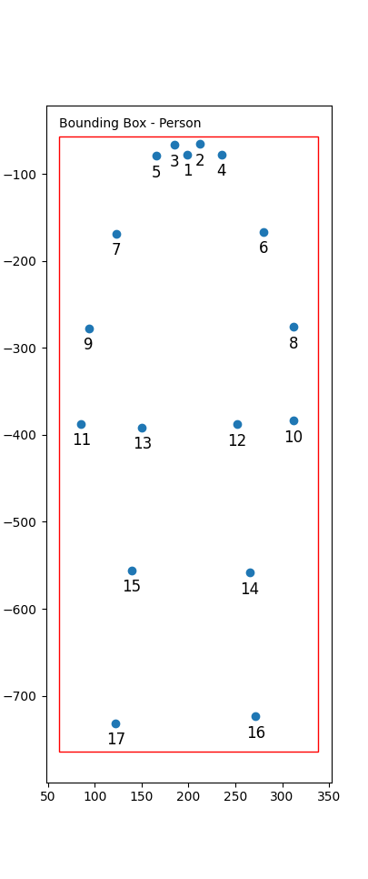

# Helpfull Notes on OpenPifPaf

## Understanding keypoint file format:

the keypoint file is generated by passing the option --json-output to the prediction function. This will output the following string representation of a json to a .json file. If a one runs a video then each frame is output to a new line:

    [{"keypoints": [x1, y1, c1, x2, y2, c2, ..., x17, y17, c17], "bbox": [xmin, ymin, xmax, xmin], "score": value, "category_id": value}]

Here x, y and c correspond to x-coordinate, y-coordinate and confidence-keypoint. x- and y-coordinates are representet in absolute value of the pixel-coordinate.

Example:

    [{"keypoints": [199.11, 77.58, 0.99, 212.59, 65.5, 0.99, ..., 122.6, 731.65, 0.93], "bbox": [61.92, 56.63, 276.58, 707.51], "score": 0.973, "category_id": 1}]

Label | Value
---|---
category_id| 1 (Person)
bounding box| [61.92, 56.63, 276.58, 707.51]
nose coordinates and conf| 199.11, 77.58, 0.99
... | ...
right foot coordinates and conf| 122.6, 731.65, 0.93
overall confidence| 0.973

## Keypoint mapping:

|  |  |
|--| -----------------|
|  |     <table><tr><th>Keypoint</th><th>Bodypart</th></tr><tr><td>1</td><td>nose</td></tr><tr><td>2</td><td>left_eye</td></tr><tr><td>3</td><td>right_eye</td></tr><tr><td>4</td><td>left_ear</td></tr><tr><td>5</td><td>right_ear</td></tr><tr><td>6</td><td>left_shoulder</td></tr><tr><td>7</td><td>right_shoulder</td></tr><tr><td>8</td><td>left_elbow</td></tr><tr><td>9</td><td>right_elbow</td></tr><tr><td>10</td><td>left_wrist</td></tr><tr><td>11</td><td>right_wrist</td></tr><tr><td>12</td><td>left_hip</td></tr><tr><td>13</td><td>right_hip</td></tr><tr><td>14</td><td>left_knee</td></tr><tr><td>15</td><td>right_knee</td></tr><tr><td>16</td><td>left_ankle</td></tr><tr><td>17</td><td>right_ankle</td></tr></table>
