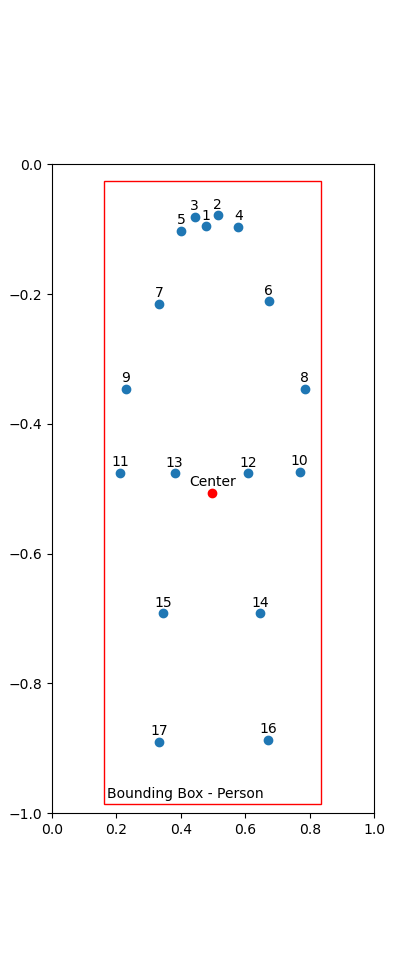

# Helpfull Notes on yolov8 pose

## Understanding keypoint file format:

the keypoint file is generated by passing the option save_txt=True to the prediction function (optionaly one can get an overall confidence 
score by additionaly passing save_conf=Ture in the prediction function). This will output the following string, of 57 values seperated by 
spaces and line breaks, formated as follows for each detection:

    <class-index> <x-center> <y-center> <width> <height> <x1> <y1> <c1> <x2> <y2> <c2> ... <x17> <y17> <c17> <overall-confidence>

Here x, y and c correspond to x-coordinate, y-coordinate and confidence-keypoint. x- and y-coordinates are representet in relative possition of the pixel-coordinate.

Example:

    0 0.497537 0.50612 0.674877 0.960832 0.476976 0.0949558 0.994924 0.513865 0.0783726 0.982051 ... 0.333336 0.889691 0.974624 0.915785

Label | Value
---|---
class-index| 0 (Person)
bounding box center| 0.497537 0.50612
bounding box with and height| 0.674877 0.960832
nose coordinates and conf| 0.476976 0.0949558 0.994924
... | ...
right foot coordinates and conf| 0.333336 0.889691 0.974624
overall confidence| 0.915785

## Keypoint mapping:

|  |  |
|--| -----------------|
|  |     <table><tr><th>Keypoint</th><th>Bodypart</th></tr><tr><td>1</td><td>nose</td></tr><tr><td>2</td><td>left_eye</td></tr><tr><td>3</td><td>right_eye</td></tr><tr><td>4</td><td>left_ear</td></tr><tr><td>5</td><td>right_ear</td></tr><tr><td>6</td><td>left_shoulder</td></tr><tr><td>7</td><td>right_shoulder</td></tr><tr><td>8</td><td>left_elbow</td></tr><tr><td>9</td><td>right_elbow</td></tr><tr><td>10</td><td>left_wrist</td></tr><tr><td>11</td><td>right_wrist</td></tr><tr><td>12</td><td>left_hip</td></tr><tr><td>13</td><td>right_hip</td></tr><tr><td>14</td><td>left_knee</td></tr><tr><td>15</td><td>right_knee</td></tr><tr><td>16</td><td>left_ankle</td></tr><tr><td>17</td><td>right_ankle</td></tr></table>
